# Ultra-CPU

Note: this is a part of a larger set of repositories, with [upet_family[() as the main repository.

This is the CPU board for a re-incarnation of the Commodore PET or other computer(s) from the later 1970s.

It is build on a Eurocard board and has only parts that can still be obtained new in 2024.
It uses the [CS/A bus interface](http://www.6502.org/users/andre/csa/index.html) to use other I/O boards.

As the memory mapping is programmable using the FPGA on the board, multiple types of computers can
potentially re-created. I started with my favourite one, the Commodore PET.

The reason this board is called Ultra-CPU is because it can potentially be used to recreate not only the Commodore PET.
The downside compared to the Micro-PET is, that it needs a separate I/O board to re-create a Commodore PET.
This can be found [here on my CS/A page](http://www.6502.org/users/andre/csa/petio/index.html).

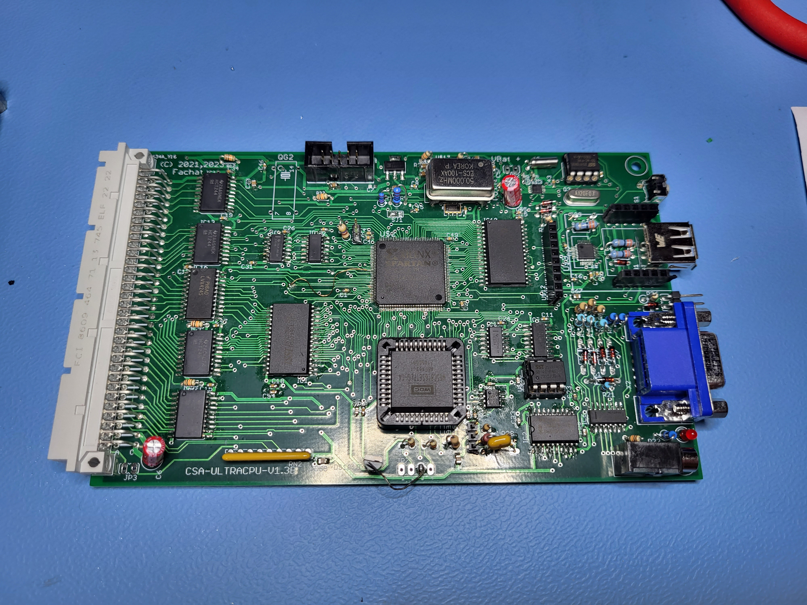

## Features

The board is built with a number of features:

- Commodore 3032 / 4032 / 8032 / 8296 with options menu to select at boot
  - Boot-menu to select different PET versions to run (BASIC 1, 2, 4)
  - 40 col character display
  - 80 col character display
- Improved system design:
  - 512k video RAM, plus 512k fast RAM, accessible using banks on the W65816 CPU
  - boot from an SPI Flash ROM
  - up to 17.5 MHz mode (via configuration register)
  - Write protection for the PET ROMs once copied to RAM
  - lower 32k RAM mappable from all of the 512k fast RAM
- Improved Video output:
  - VGA color video output (RGBI in 768x576 mode)
  - based on 768x576@60Hz VGA video timing (i.e. including borders at 40/80 columns)
  - modifyable character set
  - 40/80 column display switchable
  - 25/50 rows display switch
  - multiple video pages mappable to $8000 video mem address
  - Mulitple colour modes (Colour-PET, C128 VDC-compatible, Multicolour)
  - Colour Hires (VDC-compatible, Multicolour)
  - 16 colours out of a colour palette of 64 colours displayed simultaneously.
- DAC audio output
  - DMA engine to play audio samples on stereo sound output
- Built-in extra hardware:
  - USB host mode interface (for keyboard / mouse)
  - Real-Time-Clock (battery-buffered)
  - Ethernet/Wifi (via Breakout board)
  - SD-Card (via Breakout board)
- CS/A bus interface
  - multiple options to use bus devices, e.g. in I/O window
  - Together with [Ultra-Bus](https://github.com/fachat/csa_ultrabus) backplane Apple-II and RC2014 devices can be used

## Overview

The system architecture is actually rather simple, as you can see in the following graphics.

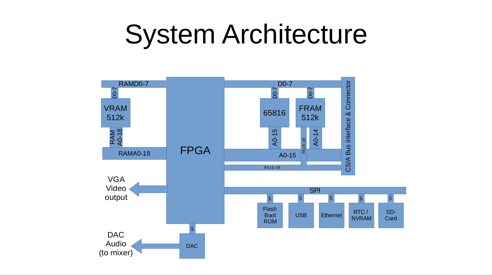

The main functionality is "hidden" inside the FPGA. It does:

1. clock generation and management
2. memory mapping
3. video generation.
4. SPI interface and boot

On the CPU side of the FPGA it is actually a rather almost normal 65816 computer, 
with the exception that the bank register (that catches and stores the address lines 
A16-23 from the CPU's data bus) is in the FPGA, and that there is no ROM. The ROM has been
replaced with some code in the FPGA that copies the initial program to the CPU accessible
RAM, taking it from the Flash Boot ROM via SPI. This actually simplifies the design,
as 

1. parallel ROMs are getting harder to come by and
2. they are typically not as fast as is needed, and
3. with the SPI boot they don't occupy valuable CPU address space.

The video generation is done using time-sharing access to the video RAM.
The VGA output is 768x576 at 60Hz. So there is a 28ns slot per pixel on the screen, 
with a pixel clock of 35MHz.

The system runs at 17.5MHz, so a byte of pixel output (i.e. eight pixels) has four
memory accesses to VRAM. Two of them are reserved for video access, one for fetching the
character data (e.g. at $08xxx in the PET), and the second one to fetch the "character ROM"
data, i.e. the pixel data for a character. This is also stored in VRAM, and is being loaded
there from the Flash Boot ROM by the initial boot loader.

The FPGA reads the character data, stores it to fetch the character pixel data, and streams
that out using its internal video shift register.

For more detailled descriptions of the features and how to use them, pls see the 
[FPGA repository](https://github.com/fachat/upet_fpga),
as described in the next section.

## Version History

- [Revision 1.3C](https://github.com/fachat/csa_ultracpu/tree/r1.3c): first working version using a Spartan 3E FPGA
- [Revision 1.2B](https://github.com/fachat/csa_ultracpu/tree/csa_ultracpu_1.2b): Version with CPLD and external colour generation.

## Building

Here are three subdirectories:

- [Board](Board/) That contains the board schematics and layout
- [Demo](Demo/) Some demo programs
- [tests](tests/) Some test programs

- [FPGA code](https://github.com/fachat/upet_fpga) This separate repository contains the VHDL code to program the FPGA logic chip used, and describes the configuration options - including the SPI and DAC usage and the Video feature and register description.
- [ROM](https://github.com/fachat/upet_roms) This separate repository contains the ROM contents to boot

### Board

To build the board, you have to find a provider that builds PCBs from Eagle .brd files.
Additionally, gerber files and a full Bill-of-material are provided in the Board subdirectory.

### FPGA

The FPGA is a Xilinx Spartan 6 programmable logic chip. It runs on 3.3V, 
so the bus interface has to convert between 3.3V and 5V. Compared to previous versions and the Micro-PET, also
the RAM and CPU on this board run on 3.3V now.
The FPGA logic here is programmed in VHDL.

The FPGA programming is actually stored in an SPI Flash Prom, so makes re-creating it even easier compared to 
the previous versions that used a CPLD - the CPLD required a separate programmer, now a (serial) Flash programmer suffices.

### ROM

The ROM image can be built using gcc, xa65, and make. Use your favourite EPROM programmer to burn it into the SPI Flash chip.

The ROM contains images of all required ROM images for BASIC 1, 2, and 4, and corresponding editor ROMs, including
some that have been extended with wedges and colour-PET functionality.

The updated editor ROMs are from [Steve's Editor ROM project](http://www.6502.org/users/sjgray/projects/editrom/index.html) and can handle C64 keyboards, has a DOS wedge included, and resets into the Micro-PET boot menu.

For more details see the [ROM repository](https://github.com/fachat/upet_roms)

## Gallery

### The system

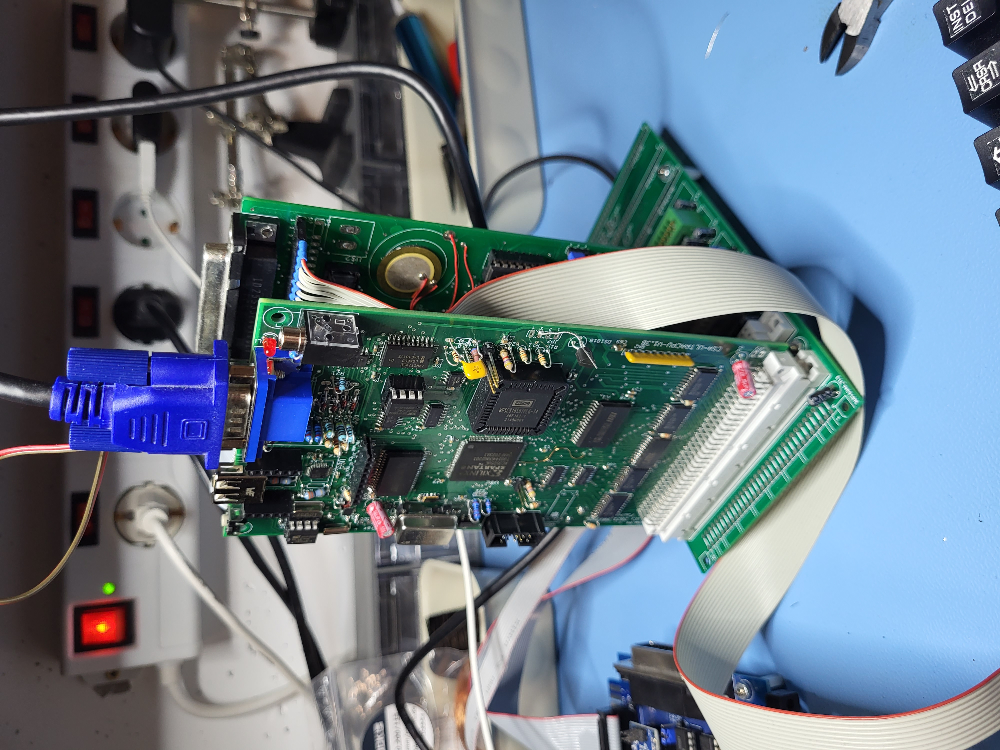

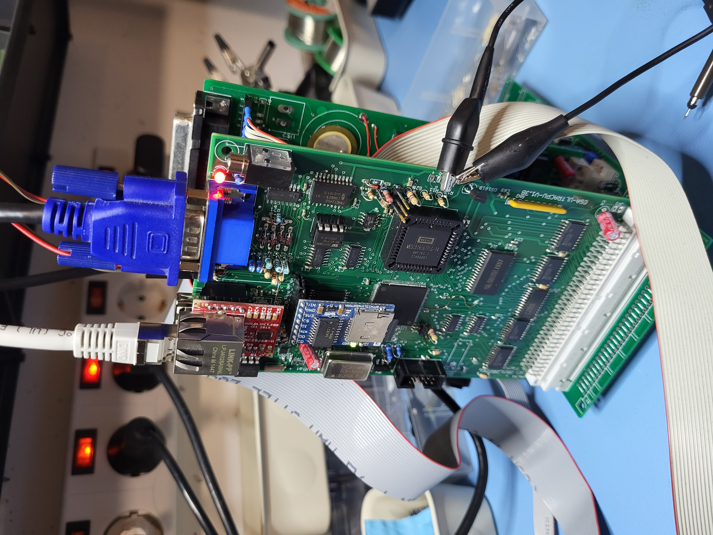

### Graphics feature overview

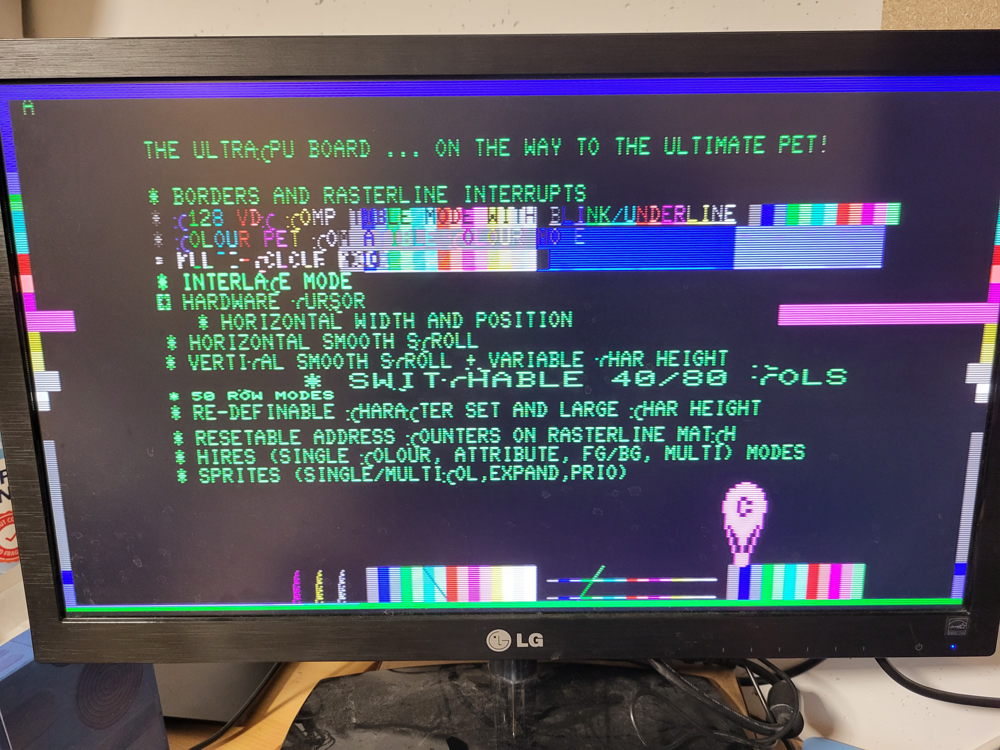

Note that this version is without the (optional) "Brown Fix" that is included in version 1.0B of the board.

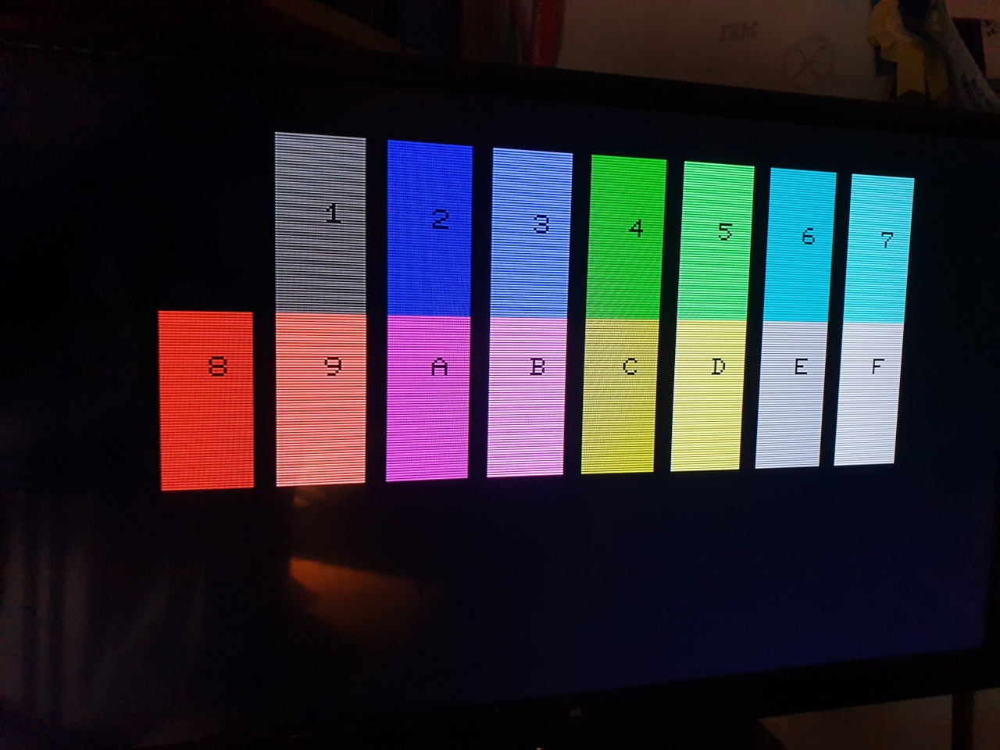

### Board

### Boot menu and OS boot screen

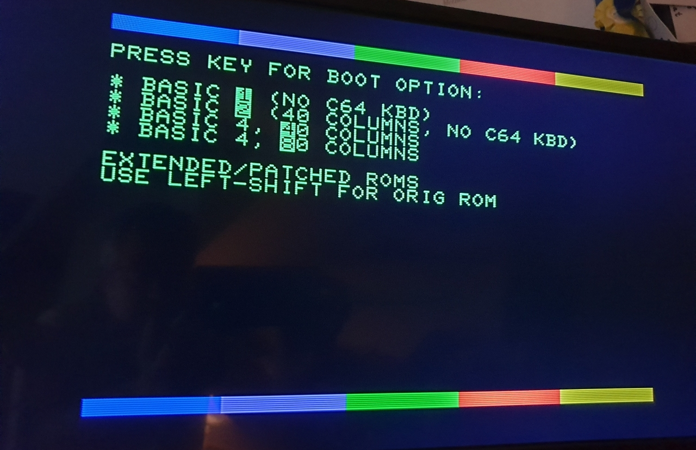

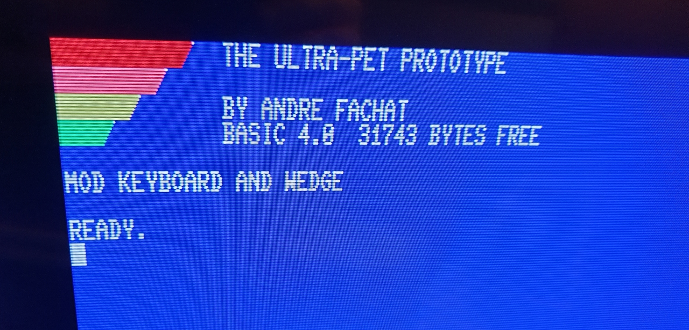

### V1.2 system views

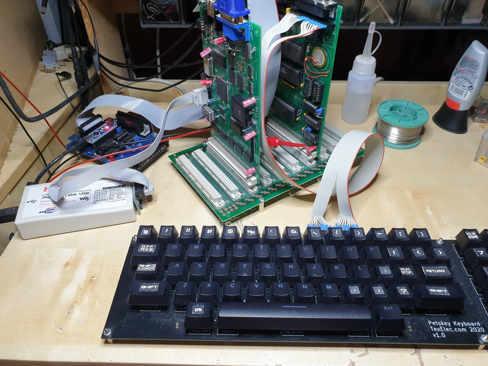

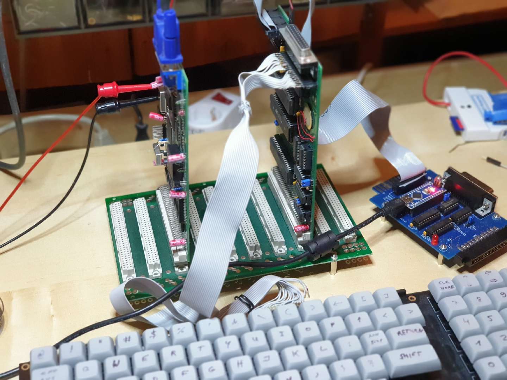

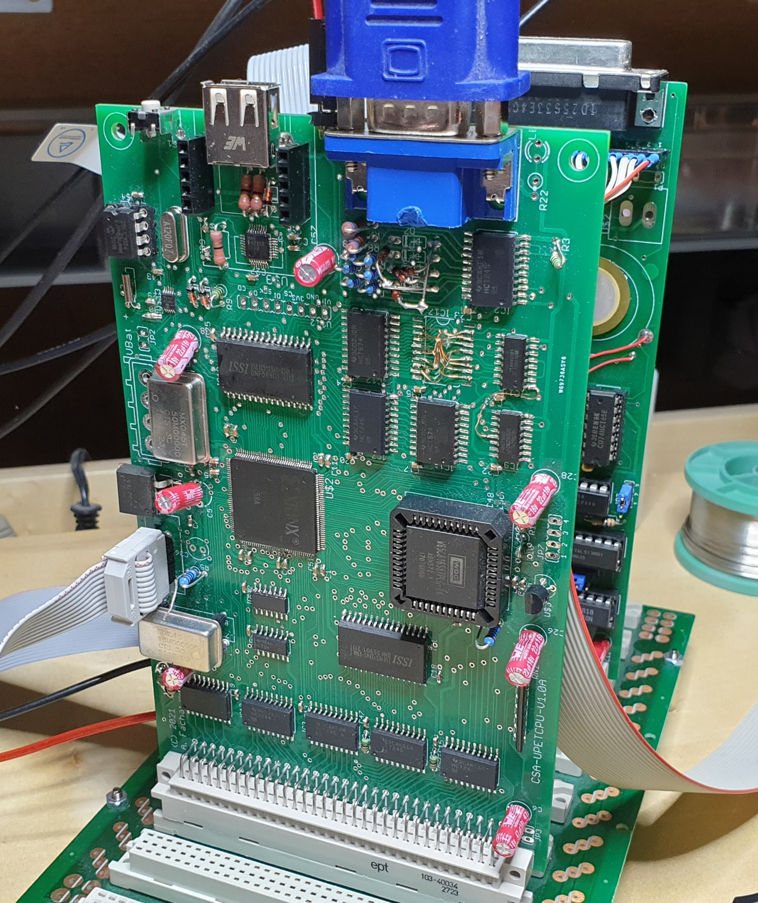

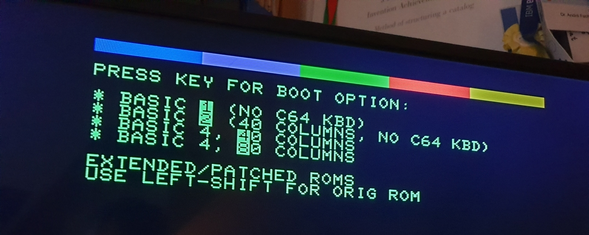

### Debugging during development

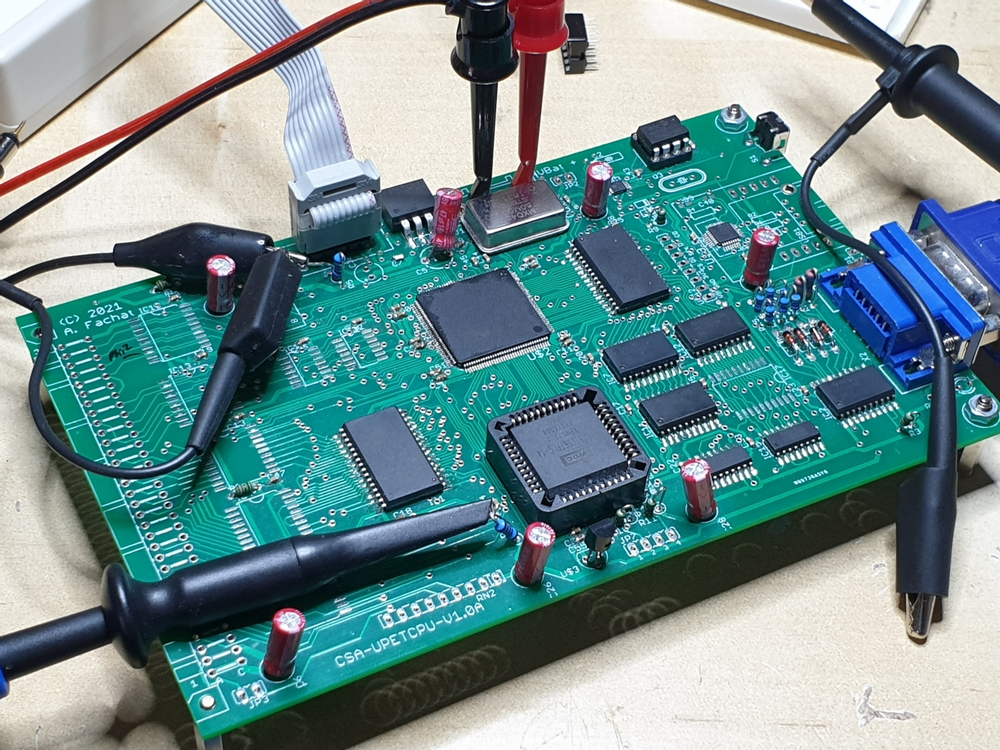
 
